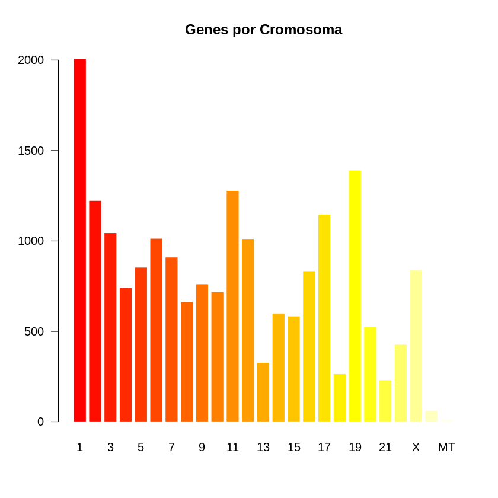
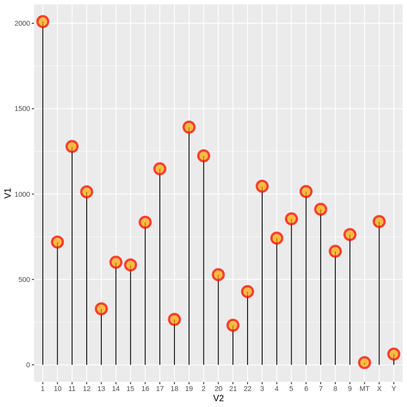

# Introducción a Bioinformática

## CONTENIDO

- [BASH PIPELINES](#bash-pipelines)
- [PYTHON SCRIPTS](#python-scripts)
- [R SCRIPTS](#r-scripts)
- [ENTREZ NCBI PERL](#entrez-ncbi-perl)


## BASH PIPELINES

### COMANDO PRÁCTICOS

Los lenguajes de programación tienen un gran cantidad de aplicaciones para bioinformatica, entre ellos linux representa una ventaja por que la terminal con la que nos comunicamos con linux corre un lenguaje de programación (BASH), al igual que otros lenguajes de programación nos permite la automatización de tareas en la cual se integran diversas herramientas. Como estaremos trabajando en el CLI cualquier comando está a un comando de distancia, bash tiene a su disposición el mismo centro de operaciones.

### Eliminar espacios en blanco
``` bash
sed '/^$/d' file.txt

grep . file.txt

grep "\S" file.txt
```

### Imprimir lineas entre rangos
``` bash
awk 'NR>=20&&NR<=80' input.txt
```

### Extraer 10 lineas al azar de un documento
``` bash
shuf file.txt | head -n 10
```

### Separar multifasta
``` bash
awk '/^>/{s=++d".fa"} {print > s}' multi.fa
```

### Separar una secuencia especifica de un fasta

``` bash
samtools faidx file.fasta

samtools faidx "ID_seq" file.fasta > ID_seq.fasta
```
### Conteo de secuencias en FastQ
``` bash
fgrep -i "@S" file.fq | wc -l

cat file.fq | echo $((`wc -l`/4))
```
### Nombre de los genes anotados 
``` bash
grep $'\tgene\t' sequence.gff3 | perl -ne '/ID=([^;]+)/ and printf("%s\n", $1)'

grep $'\tgene\t' sequence.gff3 | awk '{print $9}' | cut -d';' -f1 | sed "s/ID=//g"
```
### Mesclando scripts:

``` bash
grep $'\tgene\t' sequence.gff3 | awk '{print $5-$4";"$9}'| sed 's/Name=//g' | awk -F';' '{print $3"\t"$1}' | sort -k2n  > Tamaño_genes.txt

awk '{print $3}' sequence.gff3 | sort -d | uniq -c
```


## PYTHON SCRIPTS

### Instalando Packages
    
**Instalación de PIP**
``` bash   
sudo apt-get install python3 python3-pip

pip3 install biopython

pip3 install Bio
```

**Instalación conda** [ Miniconda ](https://docs.conda.io/en/latest/miniconda.html#installing) [ Anaconda ](https://www.anaconda.com/products/individual)
``` bash
bash <Mini/A>conda3-latest-Linux-x86_64.sh

conda install -c conda-forge biopython
```
### Importando Packages
``` python 
from Bio import Entrez
Entrez.email = "francisco.ascue@unmsm.edu.pe"

handle = Entrez.efetch(db="Nucleotide", id="AY994334.1",rettype="fasta",retmode="text")

print(handle.read())
``` 


## R SCRIPTS

### Instalando Packages
```r
install.package("BiocManager")
    
##Cargando packages

library(BiocManager)
    
BiocManager::install("ggplot2")

##Actualizando packages

install.packages(c("BiocManager","ggplot2")
    
update.packages(ask = FALSE)

### Cargar tablas (csv, tsv)

read.table("datafile.ext", sep = ",", header = TRUE)
    
read.csv("datafile.csv")
    
### Cargar paletas de colores

library(viridisLite)
library(viridis)
library(RColorBrewer)
display.brewer.all()
``` 

``` r
### barplot basicos

barplot(height = gene$V1, border = FALSE, names.arg = gene$V2, 
        las = 1 ,
        col = heat.colors(25),
        main = "Genes por Cromosoma")
```


``` r
ggplot(gene, aes(x=V2, y=V1)) +
  geom_segment( aes(x=V2, xend=V2, y=0, yend=V1)) +
  geom_point( size=5, color="red", fill=alpha("orange", 0.3), alpha=0.7, shape=21, stroke=2) 
```



## ENTREZ NCBI PERL
``` bash
esearch -db $"" -query $"" 

```


